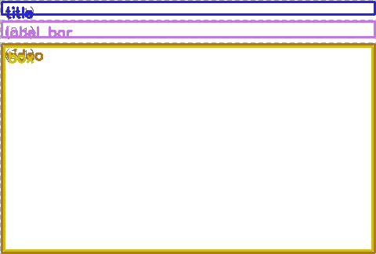

# VidPlot

|  |  |  |
|:---:|:---:|:---:|
| Annotated Video | Layout Example | Animated Demo |

## Features
- Intuitive label bar visualization for temporal data
- Layout debugging
- First-frame preview before you commit to running the entire video
- Versatile data input support: pandas, NumPy, CSV, JSON
- Comprehensive annotation capabilities: bounding boxes, segmentation masks, pose keypoints
- Multi-backend flexibility: OpenCV core with optional Decord or PyAV integration
- Matplotlib-inspired styling system for consistent visual theming
- Grid-based layout engine for pixel-perfect video composition

## Installation

**Basic install:**
```bash
pip install  -e .
```

**With optional Decord support:**
```bash
pip install .[decord]
```

**With optional PyAV support:**
```bash
pip install .[av]
```

## Demo

See the [demo](demo/) folder for an example script on how to use VidPlot. The script `demo/demo.py` takes as inputs the assets within `demo/assets` and outputs an annotated video in `demo/output/`.

Run `python demo/demo.py` to get started.

**Example output:**


## Quick Start: API

```python
from vidplot.streamers import VideoStreamer, LabelBarStreamer, StaticDataStreamer
from vidplot.renderers import RGBRenderer, LabelBarRenderer, StringRenderer
from vidplot.core.video_canvas import VideoCanvas
from vidplot.style import use_style, rcParams

# Apply a global style preset and customize further
use_style('dark')
rcParams().font_family = "DejaVu Sans"
rcParams().font_size = 24

# Set up streamers
vid_streamer = VideoStreamer("video", "input.mp4")
label_streamer = LabelBarStreamer(
    name="labels",
    data_source="labels.csv",
    time="time",
    data="label",
    duration=vid_streamer.duration,
    num_samples=int(vid_streamer.duration * 30),
)
string_streamer = StaticDataStreamer("string_overlay", "Overlay!")

# Set up renderers (can override style per-renderer)
video_renderer = RGBRenderer("video", vid_streamer)
label_bar_renderer = LabelBarRenderer("label_bar", label_streamer, height=32, font_size=18)
string_renderer = StringRenderer("string_overlay", string_streamer, font_color=(255,0,0), font_scale=1.2)

# Compose with VideoCanvas (grid-based layout)
canvas = VideoCanvas(row_gap=5, col_gap=0)
canvas.attach(vid_streamer, video_renderer, grid_row=2, grid_col=1, height=[vid_streamer.size[1]], width=[vid_streamer.size[0]], z_index=0)
canvas.attach(label_streamer, label_bar_renderer, grid_row=1, grid_col=1, height=[32], width=[vid_streamer.size[0]], z_index=0)
canvas.attach(string_streamer, string_renderer, grid_row=2, grid_col=1, height=[vid_streamer.size[1]], width=[vid_streamer.size[0]], z_index=1)
canvas.write("output.mp4", fps=30.0)
```

## Styling System

VidPlot includes a comprehensive styling system that allows you to configure visual parameters globally and override them locally for individual renderers.

### Quick Start

```python
from vidplot.style import rc, use_style, rcParams

# Set global defaults
use_style('dark')
rc('font_scale', 1.2)
rcParams().font_family = "DejaVu Sans"

# Create renderers with custom styling
renderer = StringRenderer("title", streamer,
                         font_color=(255, 0, 0),  # Red text
                         thickness=3)             # Bold
```

### Available Features

- **Global Configuration**: Set defaults for all renderers
- **Local Overrides**: Customize individual renderers with `**kwargs`
- **Predefined Themes**: Dark, minimal, high-contrast themes
- **Context Management**: Temporary styling changes
- **Dynamic Formatting**: Automatic number formatting

For detailed documentation, see the [Styling Guide](docs/styling_guide.md).

## Development & Testing

**Generate test data:**
```bash
python tests/scripts/generate_test_videos.py
python tests/scripts/generate_test_labels.py
python tests/scripts/generate_test_segmentations.py
```

**Run all tests:**
```bash
pytest
```

## How VidPlot Works

VidPlot is built around a flexible, modular architecture inspired by modern UI frameworks. Here's how the core components interact:

- **Data Streamers**: Emit data over time (video frames, labels, masks, etc.).
- **Renderers**: Draw data from streamers onto a canvas. Each renderer can be placed in a grid cell and layered with z-index.
- **VideoCanvas**: The video canvas. Attach streamers and renderers to grid positions, supporting flexible row/column spans and per-cell sizing. Handles different sampling rates and aligns their times.

This design makes it easy to add new annotation types, combine multiple visualizations, and create complex, multi-modal video layouts with minimal code changes.

## Extending VidPlot

VidPlot is designed to be extensible. Possible future work:

| Status | Extension Type         | Example Use Case                | How to Extend / Notes                                                                 |
|:------:|-----------------------|---------------------------------|--------------------------------------------------------------------------------------|
|   ⬜️    | **Keypoint Labeling** | COCO-style pose estimation      | Implement the optionality to have labels for each joint.           |
|   ⬜️    | **General Keypoints** | Animal pose, facial landmarks   | Create a custom keypoint renderer; support arbitrary skeletons or point sets.        |
|   ✅    | **Segmentation**      | Masks, polygons, RLE encoding   | Added a segmentation renderer using RLE for efficient mask storage.                  |

**Tip:** See the `vidplot/renderers/` and `vidplot/streamers/` folders for examples.

## License

**MIT** 
 