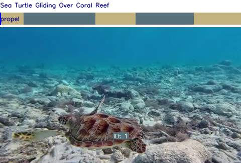

# VidPlot

**VidPlot** is a Python package for visualizing and annotating videos, designed for computer vision and data science workflows. It provides tools to overlay annotations, visualize object tracking, and interactively explore video datasets.

## Features
- Overlay bounding boxes, labels, and custom annotations on videos
- Support for OpenCV and optional Decord or PyAV backends
- Easy integration with pandas DataFrames and numpy arrays
- Progress bars and batch processing with tqdm
- Interactive visualization with matplotlib

## Installation

**Basic install:**
```bash
pip install  -e .
```

**With optional Decord support:**
```bash
pip install .[decord]
```

**With optional PyAV support:**
```bash
pip install .[av]
```

## Demo

See the [demo](demo/) folder for an example script on how to use VidPlot. The script `demo/demo.py` takes as inputs the assets within `demo/assets` and outputs an annotated video in `demo/output/`.

**Example output:**



## Development & Testing

**Generate test data:**
```bash
python tests/scripts/generate_test_videos.py
python tests/scripts/generate_test_labels.py
python tests/scripts/generate_test_segmentations.py
```

**Run all tests:**
```bash
pytest
```

## How VidPlot Works

VidPlot is built around a flexible, modular architecture inspired by modern UI frameworks. Here's how the core components interact:

- **Data Streamers**: These are responsible for emitting data over time. A data streamer could emit video frames, keypoints, labels, segmentation masks, or any other annotation data. Streamers can be static (always emit the same data) or dynamic (emit a sequence over time).

- **Renderers**: Renderers take the data emitted by streamers and draw it onto a canvas. Each renderer knows how to visualize a specific type of data (e.g., bounding boxes, keypoints, label bars). Renderers also define their own layout information—such as which grid cell(s) they occupy and their z-index (draw order).

- **One-to-Many Mapping**: Each data streamer can be visualized by multiple renderers. For example, a single set of keypoints could be rendered as both a skeleton and a heatmap.

- **Orchestrator**: The orchestrator manages the overall layout and composition. It arranges renderers in a CSS-style grid layout, where each renderer specifies its row/column span and z-index (layering order). The orchestrator synchronizes data from all streamers and ensures that each frame is composed correctly, respecting layout and layering.

This design makes it easy to add new annotation types, combine multiple visualizations, and create complex, multi-modal video layouts with minimal code changes.

## Extending VidPlot

VidPlot is designed to be extensible. Possible future work:

| Status | Extension Type         | Example Use Case                | How to Extend / Notes                                                                 |
|:------:|-----------------------|---------------------------------|--------------------------------------------------------------------------------------|
|   ⬜️    | **Keypoint Labeling** | COCO-style pose estimation      | Implement the optionality to have labels for each joint.           |
|   ⬜️    | **General Keypoints** | Animal pose, facial landmarks   | Create a custom keypoint renderer; support arbitrary skeletons or point sets.        |
|   ✅    | **Segmentation**      | Masks, polygons, RLE encoding   | Added a segmentation renderer using RLE for efficient mask storage.                  |

**Tip:** See the `vidplot/renderers/` and `vidplot/streamers/` folders for examples.

## License

**MIT** 
 